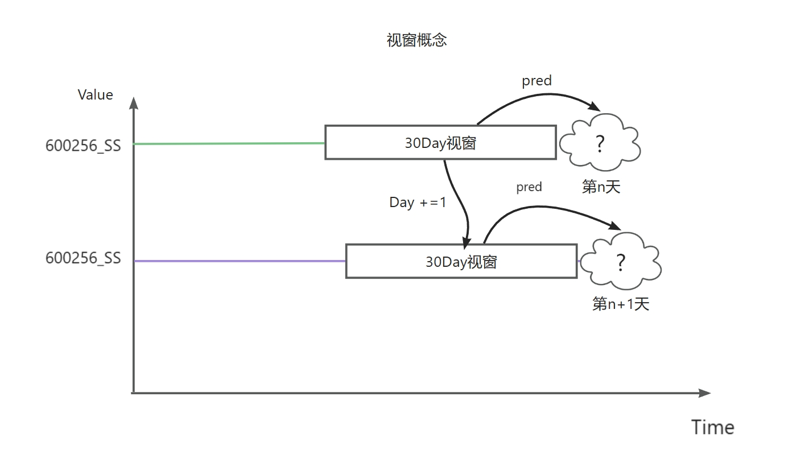
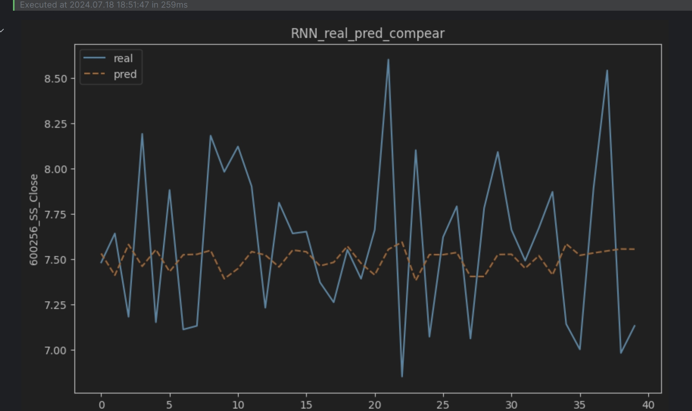
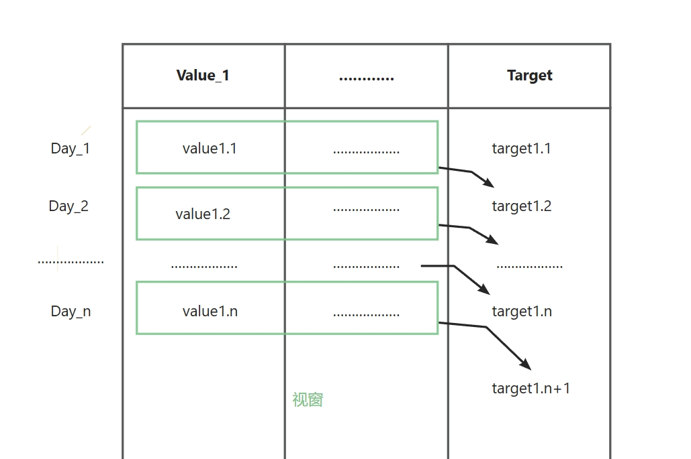
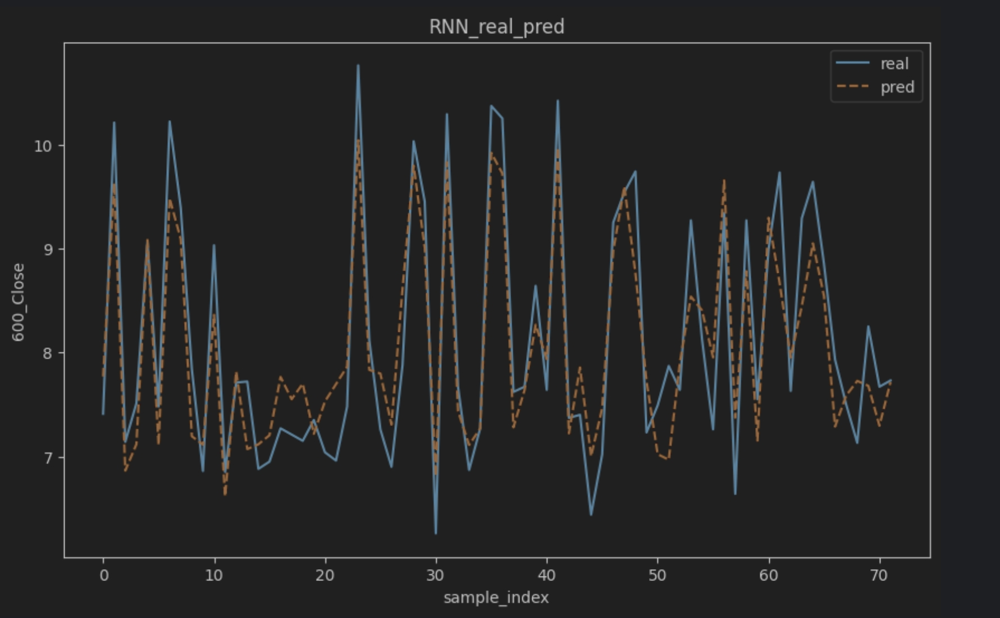
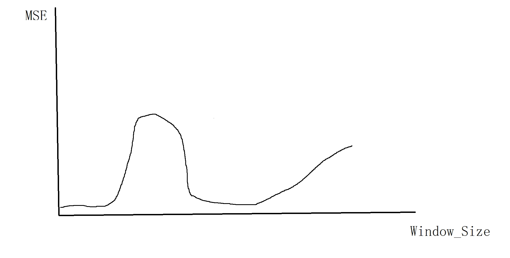

# 股票分析步骤记录文档 V2.0（喜开新V版🥳🥳🥳）

## 0.题目
（1）基于Python爬虫实现股票数据的采集。采集上证指数、深证指数、恒生指数、纳斯达克、英国富时100指数、德国DAX指数、法国CAC40指数数据，及其1家新疆本地上市企业股票数据，时间不少于100天。

（2）分析新疆企业数据与各指数的序列相关性，为进一步辅助新疆企业股票数据预测筛选外部知识。

（3）基于深度学习序列模型如RNN、LSTM、Transformer等，进行新疆企业的股票趋势预测。可使用单变量时间序列预测模型，为探索外部知识对数据预测的重要作用，推荐使用多元时间序列预测模型，已获取更精准的预测。

## 1.思路

引入一种视窗概念，假设有一个固定宽度的窗户，通过这个窗户观察外面的内容收集的信息量是一定的.
### Mlt_DAY视窗

观察一定量天数的数据。例如通过视窗观察近30天数据，通过多维数据拟合今日（n）的闭市股价
但是，这种方法可能会使用被预测出的数据来预测（更远的）未来的数据，在大的视窗上格外明显
#### rnn网络拟合(好像确实不太行)

### One_DAY视窗
Mlt_DAY视窗的特殊形式，只观察今天天各大指数的收盘数据，预测明天的闭市股价

这种拟合方式类似与第一版RNN类似，只需要将 600_Close 这一列均向下平移一个cell就可以做成新的数据集（但是感觉好像不怎么对啊，这也太准了）：

## 总结（假设实验结果都正确的前提下🤔）
| RANK |    NAME     | MSE | Window_SIZE |
|:----:|:-----------:|:---:|:-----------:|
|  1   | Mlt_Day_RNN |  0.212652   |     160     |
|  2   | Mlt_Day_RNN | 0.221171   |     100     |
|  3   | One_Day_RNN |  0.237400   |      1      |
|  4   | Mlt_Day_RNN |  0.466851   |     300     |
|  5   | Mlt_Day_RNN |  0.524191  |     60      |

看出在Window_SIZE=1的情况下  均方误差 也并不比Window_SIZE为较大时表现差，或可以考虑均方误差与Window_SIZE有如下关系：

今天估计没时间了，明天开个新版本再做吧😪
