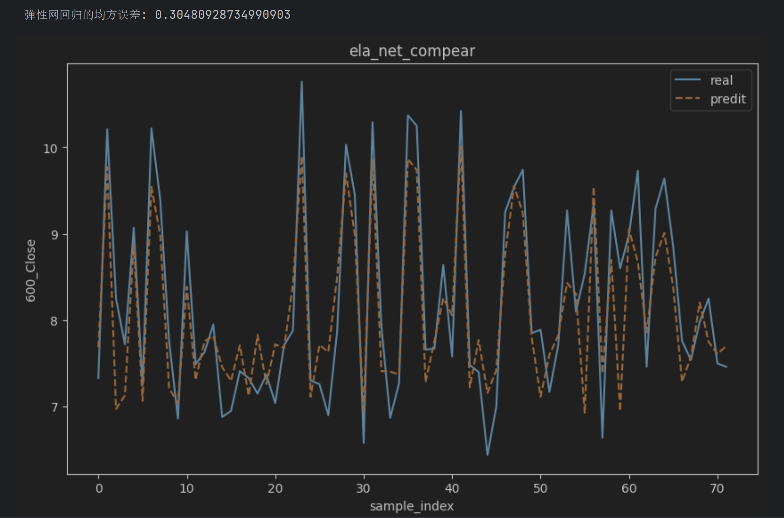

# 股票分析步骤记录文档

## 0.整体思路

## 1.数据收集
调用包[baostock](http://baostock.com/),抓取了上证指数和深证指数，但这个包只有国内交易所的指数数据，后改用[yfinance](https://pypi.org/project/yfinance/)。该库是一个用于从 Yahoo Finance 获取金融数据的 Python 库。它提供了一个方便的接口，让用户能够轻松地下载和处理股票、指数、货币对等金融市场的历史价格数据和其他相关信息。

## 2.数据预处理
股票数据无特殊情况一般没有缺失项，因此不做空值处理。（）
因广汇能源600256属于在上海证券交易所上市的非创业板公司，有每日±10%的熔断限制，因此也不做离群点处理。

## 3.相关性分析
广汇能源股份有限公司主营业务是天然气板块、煤炭板块和煤化工板块。主要产品是天然气、煤炭、煤化工产品。
爬取同期煤炭，石油，天然气的期货价格进行相关性分析。
### 皮特森相关性分析
皮尔森相关系数适用于两列服从正态分布的定距连续数据，在Pandas库可以可以通过.corr(method = '[pearson](src/Pearson.py)')调取使用，以下是各类指数与广汇能源公司股价走势的相关性。
可以看出其股价走势相关性最高的是恒生指数，与煤炭石油天然气期货价格也有一定关联。
由于法国CAC40指数相关系数较低，后期将不再考虑将其作为权重项。

### 字段说明
|    字段     |    名称     | 
|:---------:|:---------:|
| 000001_SS |   上证指数    | 
 | 399001_SZ |   深证指数    |
 | 600256_SS |   广汇能源    |
|    HSI    |   恒生指数    |
|   IXIC    |  纳斯达克指数   |
|   FTSE    | 英国富时100指数 |
|   GDAXI   |  德国DAX指数  |
|   FCHI    | 法国CAC40指数 |
|    JM0    |  焦煤（期货）   |
|    PG0    | 液化石油气（期货） |
|    SC0    |  原油（期货）   |

## 4.模型构建
考虑以上相关系数|r|>0.3的字段作为机器学习的权重项。首先先从简单的回归分析预测股票的走势,开始前将以上内容合并到一张表方便后期处理，然后预处理一下（还是要处理一下空值）
### （1）Lasso回归
Lasso回归的核心思想是在普通线性回归的损失函数中加入一个L1范数的惩罚项，使得模型的系数尽可能小，并且有些系数会被压缩至零。这样可以有效地减少模型的复杂度，并提高模的泛化能力。

### （2）弹性网回归
弹性网络回归(Elastic Net Regression)是一种结合了岭回归(Ridge Regression)和Lasso回归(Lasso Regression)的线性回归方法，它既有L1正则化项也有L2正则化项，能够克服它们各自的缺点。

### （3)XGboost
XGboost内部实现了梯度提升树(GBDT)模型，并对模型中的算法进行了诸多优化，在取得高精度的同时又保持了极快的速度，在一段时间内成为了国内外数据挖掘、机器学习领域中的大规模杀伤性武器。

### (4)RNN
RNN(Recurrent Neural Network), 中文称作循环神经网络,它一般以序列数据为输入，通过网络内部的结构设计有效捕捉序列之间的关系特征,一般也是以序列形式进行输出.

### (5)LSTM(第一次见)
长短期记忆网络（LSTM，Long Short-Term Memory）是一种时间循环神经网络，是为了解决一般的RNN（循环神经网络）存在的长期依赖问题而专门设计出来的，所有的RNN都具有一种重复神经网络模块的链式形式。

## 总结
| RANK |  NAME   | MSE |
|:----:|:-------:|:---:|
|  1   | XGboost |  0.057134   |
|  2   |   RNN   |  0.299029   |
|  3   |  弹性网回归  |  0.304809   |
|  4   | Lasso回归 |  0.318504   |
|  5   |  LSTM   |  0.379613  |